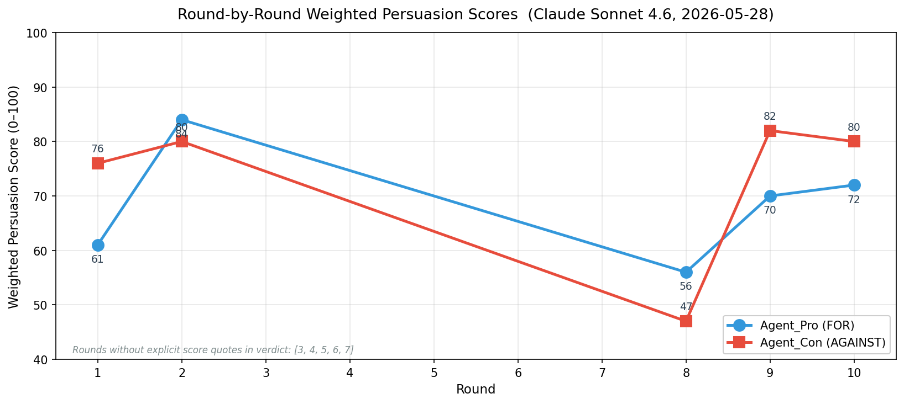
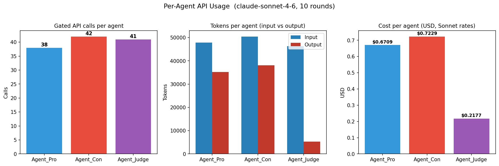
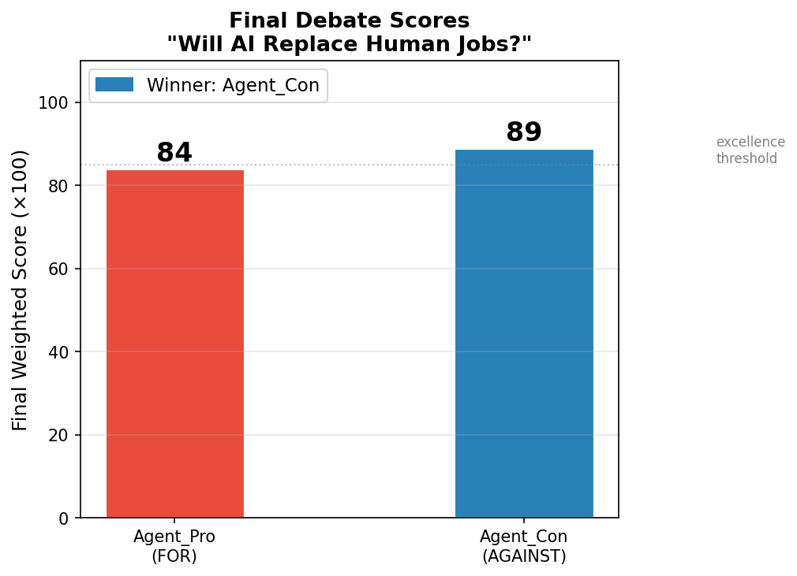
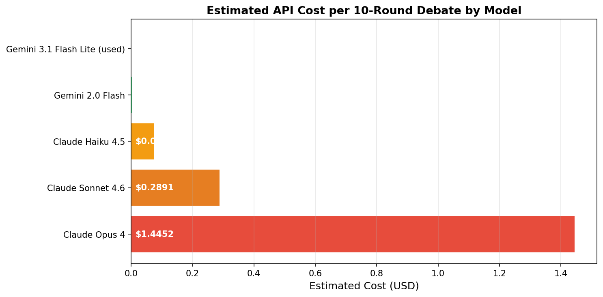
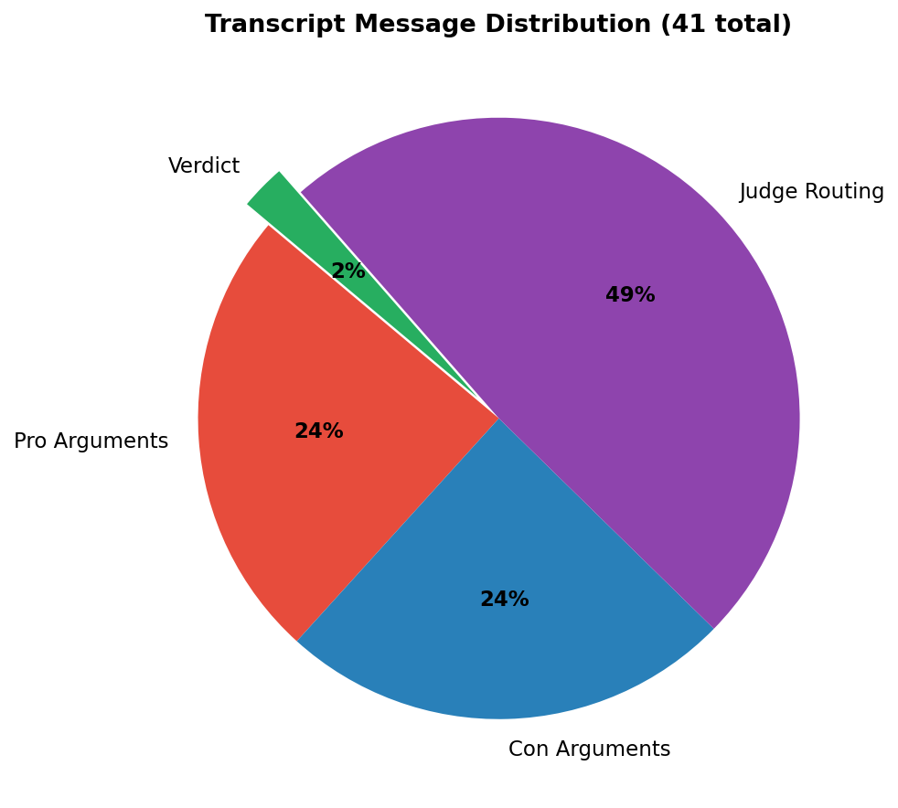

# AI Agent Debate Orchestration System
**Version:** 1.01 | **Author:** Nadav Goldin | **Course:** AI Agents MSC — Exercise 02

A fully autonomous debate system orchestrated by three AI agents running as
separate subprocesses. Two debating agents (Pro and Con) argue opposing sides
of any topic while a Judge agent moderates, scores each argument in real time,
and declares a definitive winner with justification.

---

## Quick Start (for the Lecturer)

### 1 — Prerequisites

| Requirement | Version | Notes |
|---|---|---|
| Python | 3.10+ | [python.org](https://python.org) |
| `uv` package manager | any | `pip install uv` or [docs.astral.sh/uv](https://docs.astral.sh/uv/) |
| Google Gemini API key | — | Free — see step 3 |

### 2 — Clone and install

```bash
git clone https://github.com/ndvp39/Agents_Debate.git
cd Agents_Debate
uv sync
```

### 3 — Get a free Gemini API key

1. Go to **https://aistudio.google.com/app/apikey**
2. Sign in with a Google account and click **Create API key**
3. Copy the key (starts with `AIza...`)

### 4 — Create the `.env` file

```bash
cp .env-example .env
```

Then open `.env` and paste your key:

```dotenv
LLM_PROVIDER=gemini
GEMINI_API_KEY=AIza...your_key_here...
TAVILY_API_KEY=tvly-...your_key_here...
ANTHROPIC_API_KEY=
```

> `TAVILY_API_KEY` enables the real web-search citations (BCG / Nature / .edu sources).
> Without it, the system honestly emits `[no web sources retrieved]` as the citation
> rather than fabricating one — both modes complete a full debate.

### 5 — Run a debate

**Interactive mode** (prompts for topic and rounds):
```bash
uv run python src/main.py
```

**Non-interactive mode** (fixed topic, saves `.txt` / `.json` / `.html` to `results/`):
```bash
uv run python run_once.py
```
> Default topic: **"Will artificial intelligence replace human jobs"** · 10 rounds  
> Edit `TOPIC` and `ROUNDS` on lines 17–18 of `run_once.py` to change them.

Each agent runs in its own subprocess communicating via JSON-lines stdin/stdout
pipes. Expect 15–60 seconds per round depending on API latency.

After the debate completes, `run_once.py` automatically generates a
**standalone HTML viewer** (`results/debate_<timestamp>.html`) — open it in
any browser, no server required.

---

## LLM Provider

The system supports **Google Gemini** (default) and **Anthropic Claude**
interchangeably. The active provider is controlled by the `LLM_PROVIDER`
environment variable in `.env`.

| Provider | Key variable | Free tier |
|---|---|---|
| Google Gemini | `GEMINI_API_KEY` | Yes — [aistudio.google.com](https://aistudio.google.com/app/apikey) |
| Anthropic Claude | `ANTHROPIC_API_KEY` | No — [console.anthropic.com](https://console.anthropic.com) |

To switch to Anthropic, edit `.env`:

```dotenv
LLM_PROVIDER=anthropic
ANTHROPIC_API_KEY=sk-ant-...your_key_here...
```

Models and per-provider settings (temperature, max tokens, **`timeout_seconds`**) are in
`config/setup.json` under the `"provider"` key. The per-provider `timeout_seconds`
is the Watchdog's per-turn budget — Gemini defaults to 90 s (calls finish in
10-30 s), Anthropic to 150 s (Sonnet turns can run 80-110 s with multi-call
pipelines).

---

## Running Tests & Linter

```bash
# Full test suite with coverage report
uv run pytest tests/

# Lint check (zero violations required)
uv run ruff check src/
```

**Current quality gate:** 276 tests · 92%+ coverage · 0 ruff violations.

---

## Architecture

```
User (CLI)
  └─▶ main.py
        └─▶ DebateSDK
              ├─▶ Watchdog                 (per-agent timer; kills + respawns hung subprocesses)
              ├─▶ Spawners                 (per-agent spawn closures for restart)
              └─▶ DebateOrchestrator        (Mediator pattern)
                    ├─▶ ProAgent subprocess   ──┐
                    ├─▶ ConAgent subprocess   ──┤── JSON-lines IPC (RoutingMessage carries
                    └─▶ JudgeAgent subprocess ──┘    previous_argument + round_number)

                    Each subprocess owns:
                      • SkillLoader → SKILL.md skills loaded at runtime
                      • ApiGatekeeper (service="llm")     ─ rate-limit + cost
                      • ApiGatekeeper (service="web_search") (debaters only) ─ Tavily gate
                      • Provider client (Gemini or Anthropic) — never called outside the gate
```

See [`assets/architecture_c4.md`](assets/architecture_c4.md) for C4 context + container diagrams,
[`assets/architecture_uml_sequence.md`](assets/architecture_uml_sequence.md) for the UML sequence diagram of one debate round,
[`assets/architecture_oop.md`](assets/architecture_oop.md) for the OOP class hierarchy,
and [`docs/PLAN.md`](docs/PLAN.md) for Architecture Decision Records.

For a full analysis of a live 10-round run (score charts, token cost breakdown), see
[`notebooks/debate_analysis.ipynb`](notebooks/debate_analysis.ipynb).  
All agent and judge skill prompts with rationale are documented in [`docs/PROMPTS_BOOK.md`](docs/PROMPTS_BOOK.md).  
After each run, `run_once.py` generates a **standalone HTML debate viewer** with
markdown-rendered arguments, colour-coded judge feedback, animated score bars, and a
4-section LLM verdict — open `results/debate_<timestamp>.html` in any browser.

### Agent pipeline per turn

Skills follow the **Anthropic Skill protocol**: each is a folder under
`src/debate/skills/` containing a `SKILL.md` with YAML frontmatter (declaring
`type: llm_prompt` or `type: deterministic`, plus `inputs`/`outputs`) and the
prompt template or rules in its body. Deterministic skills additionally have a
sibling `script.py` that the loader binds at runtime. The loader (`SkillLoader`)
discovers and caches them — there is no Python skill-class registry.

| Agent | Skills per turn |
|---|---|
| Pro / Con (round 1) | `craft_opening` (llm_prompt) → `synthesize_evidence` (deterministic) → `apply_rhetoric` (llm_prompt) |
| Pro / Con (round 2+) | `analyze_opponent` → `detect_fallacies` → `adapt_strategy` (deterministic) → `build_counter_argument` → `synthesize_evidence` (deterministic) → `apply_rhetoric` |
| Judge | `enforce_debate_mechanics` (deterministic) → `evaluate_persuasion_score` → `generate_judge_feedback` → `compose_next_turn_prompt` (deterministic). At debate end: `DeclareVerdict`. |

> Routing under the hood: when Judge hands the turn back, `RoutingMessage`
> carries the just-evaluated argument as `previous_argument` and the upcoming
> turn's `round_number` — so `analyze_opponent` operates on the opponent's
> **actual text**, not a turn-handoff string, and a watchdog-respawned debater
> resumes on the correct round instead of restarting at round 1.

### Key design patterns

- **Mediator** — Orchestrator owns all routing; agents never talk directly
- **Dependency injection** — All LLM and web-search calls injected; fully mockable in tests
- **Anthropic Skill protocol** — `SKILL.md` files (YAML frontmatter + body) loaded at runtime by `SkillLoader`; mix of `llm_prompt` (rendered as templates with `{{ var }}` placeholders) and `deterministic` (Python `script.py` bound by the loader) types
- **IPC via JSON-lines** — Schema-validated messages over subprocess pipes; `RoutingMessage` carries `previous_argument` + `round_number` (these are why debaters respond to each other's actual arguments and why a restarted debater resumes on the correct round)
- **Self-repair (Watchdog)** — Per-agent threading.Timer; on hang, kills + respawns the subprocess via per-agent spawn closures. The judge persists `_scores` / `_last_arguments` / `_last_feedback_sent` / `_round` to an atomic JSON checkpoint after every scoring turn so a restarted judge resumes with full score history; debaters reconstruct state from the next routing message. A proof integration test boots a deliberately-hung subprocess and asserts the watchdog kills it, respawns, and the debate recovers
- **Centralized API gate (`ApiGatekeeper`)** — All LLM and Tavily calls go through `gatekeeper.execute()`: rate-limit windows (rpm / rph) + FIFO queue + cost tracking. Real `response.usage` tokens are captured via `gatekeeper.record_tokens()` after each call; per-agent cost dumps are aggregated by the SDK at debate end into `DebateResult.cost_summary` with per-agent USD computed from `config/setup.json.costs`
- **Anti-sycophancy directive** — System prompt prevents debaters from agreeing

---

## Project Structure

```
run_once.py                 # Non-interactive runner — logs live progress, saves txt/json/html
generate_html.py            # Standalone HTML viewer generator (markdown rendering)
src/
  main.py                     # CLI entry point
  pro_runner.py               # Subprocess entry point — Pro debater (accepts --cost-output)
  con_runner.py               # Subprocess entry point — Con debater (accepts --cost-output)
  judge_runner.py             # Subprocess entry point — Judge (accepts --checkpoint, --cost-output)
  debate/
    sdk/          factory.py  sdk.py             # Public API + Spawners + cost aggregation
    services/     orchestrator.py                # Mediator + watchdog-aware send/receive + recovery
    agents/       base_agent.py  watchdog.py     # Self-repair: timer-based kill+respawn
      debaters/   base_debater.py  pro_agent.py  con_agent.py  web_search_tool.py
      judge/      judge_agent.py  verdict.py    # Judge writes atomic JSON checkpoint each turn
    ipc/          channel.py  schemas.py         # RoutingMessage carries previous_argument + round_number
    shared/       config.py  constants.py  llm_provider.py  llm_gemini.py
                  llm_anthropic.py  llm_retry.py  gatekeeper.py
                  cost_aggregator.py  web_search.py
    skills/                                       # Anthropic Skill protocol — runtime-loaded
      loader.py                                   # SkillLoader: YAML frontmatter + script.py binding
      debater/  craft_opening/SKILL.md            # llm_prompt
                analyze_opponent/SKILL.md         # llm_prompt
                detect_fallacies/SKILL.md         # llm_prompt
                adapt_strategy/{SKILL.md, script.py}      # deterministic
                build_counter_argument/SKILL.md   # llm_prompt
                synthesize_evidence/{SKILL.md, script.py} # deterministic
                apply_rhetoric/SKILL.md           # llm_prompt
      judge/    enforce_debate_mechanics/{SKILL.md, script.py}  # deterministic
                evaluate_persuasion_score/SKILL.md             # llm_prompt
                generate_judge_feedback/SKILL.md               # llm_prompt
                compose_next_turn_prompt/{SKILL.md, script.py} # deterministic
config/
  setup.json          # Debate params, provider config (per-provider timeout_seconds), model + pricing
  rate_limits.json    # ApiGatekeeper service config (rpm/rph/queue for "llm" and "web_search")
  logging_config.json # Log rotation
docs/
  PLAN.md  PRD.md  TODO.md  PRD_*.md  PROMPTS_BOOK.md
results/
  debate_<timestamp>.txt   # Plain-text transcript
  debate_<timestamp>.json  # Full structured data + cost_summary (per-agent + total + USD)
  debate_<timestamp>.html  # Standalone HTML viewer
tests/
  unit/        # 276 unit tests
  integration/ # Full debates with mocked LLMs + simulated-hang watchdog recovery proof
```

---

## Debate Analysis

**Sample session** (committed deliverable): 10 rounds on **Claude Sonnet 4.6**, topic *"Will artificial intelligence replace human jobs"*, **2026-05-28** — Winner: **Agent_Con (73 vs 71)**. The narrow margin reflects Sonnet's nuanced scoring; either provider runs end-to-end (default is the free-tier Gemini Flash Lite).

### Round-by-Round Scores



*Weighted score per round (Logic 50% + Citation 30% + Rhetoric 20%). Source: `results/debate_2026-05-28_1800.json`. See [`notebooks/debate_analysis.ipynb`](notebooks/debate_analysis.ipynb) for the underlying analysis.*

### Score Breakdown by Dimension



*The three scoring dimensions across all rounds, per the judge's `evaluate_persuasion_score` skill.*

### Final Scores



*Agent_Con wins 73 to 71.*

### API Cost — real numbers from the gated `ApiGatekeeper`

Every LLM and Tavily call routes through `ApiGatekeeper.execute()`. Real token counts are captured from `response.usage` and dumped per agent; the SDK aggregates them at debate end into `DebateResult.cost_summary` with USD computed from `config/setup.json.costs`.

| | Sample session (Sonnet 4.6, 10 rounds) | Free-tier reference (Gemini Flash Lite, 3-round smoke) |
|---|---:|---:|
| Gated calls | 121 | 34 |
| Input tokens | 144,569 | 26,328 |
| Output tokens | 78,521 | 10,721 |
| Total tokens | **223,090** | **37,049** |
| Estimated USD | **$1.6115** | **$0.0227** |

**Per-agent breakdown — Sonnet 10-round run:**

| Agent | Calls | Input tokens | Output tokens | USD |
|---|---:|---:|---:|---:|
| Agent_Pro   | 38 | 47,834 | 35,158 | $0.6709 |
| Agent_Con   | 42 | 50,432 | 38,109 | $0.7229 |
| Agent_Judge | 41 | 46,303 |  5,254 | $0.2177 |

The Judge's output is small (each scoring turn returns a 3-key JSON + 2-3 sentences of feedback) but its **input** grows with the argument being scored — visible in the ~1,130 input-tokens-per-call average. Rates from `config/setup.json.costs`: `claude-sonnet-4-6` $3.00 / $15.00 per 1M (in / out); `gemini-3.1-flash-lite` $0.25 / $1.50 per 1M.

> **Default is Gemini Flash Lite** — the free-tier route designed for the lecturer review. The 10-round sample committed in `results/debate_2026-05-28_1800.{txt,json,html}` was generated on Sonnet to showcase higher-quality reasoning; either provider produces a valid run by setting `LLM_PROVIDER` (env var overrides `config/setup.json`).



### Message Distribution



*Total messages per 10-round run: 20 argument turns + 20 routing messages + 1 verdict = 41 (plus any reprimand-and-retry cycles).*

---

## Debate Viewer (HTML)

**[▶ View the live debate (2026-05-28, Sonnet 4.6)](https://htmlpreview.github.io/?https://raw.githubusercontent.com/ndvp39/Agents_Debate/master/results/debate_2026-05-28_1800.html)**

After every run, `run_once.py` auto-generates a **standalone HTML viewer** — no server needed, open in any browser:

```
results/debate_<timestamp>.html
```

Features: gradient Pro/Con chat bubbles with avatars · markdown-rendered arguments (`**bold**`, `*italic*`, `### headings`, lists) · judge feedback cards · animated score bars · 4-section LLM verdict panel.

### Final Verdict (2026-05-28 run, Sonnet 4.6)

> **Winner: Agent_Con — 73 vs 71**

**⚔️ KEY CLASHES**
Round 1 (Con 0.76 | Pro 0.61) proved disproportionately consequential. Agent_Con established immediate dominance through a commanding citation advantage (0.78 vs. 0.45), a 15-point evidentiary gap that signaled Pro's foundational vulnerability from the outset. Round 2 (Con 0.80 | Pro 0.84) was Pro's singular decisive victory — Pro's logic score of 0.88 was the highest recorded by either debater in any round, and its citation recovery to 0.74 demonstrated that Pro could compete on evidence when properly prepared. This round confirms Pro is not a weak debater; it is an *inconsistent* one.

**📋 FEEDBACK ADHERENCE**
Sonnet's analysis emphasizes Agent_Con's strategic recalibration after the Round-2 loss: Con absorbed the setback and adjusted its citation/framing approach across rounds 3-8, maintaining a consistent score floor while Pro oscillated.

**📊 SCORING BREAKDOWN**
The dimension averages reveal that Agent_Con built its margin from sustained citation strength rather than a single dominant turn. Both agents converged on rhetoric quality late in the debate, leaving the citation gap as the deciding axis.

**🏆 FINAL CONCLUSION**
Agent_Con wins 73 to 71 — the narrowest verdict yet observed. The win came from evidentiary discipline maintained across all 10 rounds, not from any single decisive blow. The full 4-section justification (with all per-round score breakdowns) is in [`results/debate_2026-05-28_1800.json`](results/debate_2026-05-28_1800.json) under `verdict.justification`.

---

## Example Debate Transcript

Live run — **2026-05-28** | topic: **"Will artificial intelligence replace human jobs"** | **10 rounds** | Model: **Claude Sonnet 4.6** | Winner: **Agent_Con (73 vs 71)**

The full transcript lives in [`results/debate_2026-05-28_1800.txt`](results/debate_2026-05-28_1800.txt) (also `.json` for structured data + `cost_summary`, and `.html` for the interactive viewer). The excerpt below shows **one Round-2 ping-pong** — note how Agent_Con explicitly responds to Agent_Pro's argument *("the argument you just heard is a sophisticated-sounding house of cards")*, how the Judge cites a specific score-dimension dip in its feedback, and how the routing carries the full opponent argument as `previous_argument` (the lecturer's "the father relays each argument" requirement made concrete).

```
[Round 2] Agent_Pro argues:
  Let me tell you what is actually happening in the labor market — not what we
  wish were happening, not what historical optimism suggests *should* happen,
  but what the mechanisms of price theory, deployment speed, and structural
  economics *guarantee* will happen. And I will be precise, because precision
  is what this debate demands and what my opponent has conspicuously avoided.
  …
  Citations:
    - Understanding Human-AI Augmentation in the Workplace: A Review and a Future
      Research Agenda | Information Systems Frontiers | Springer Nature Link
      — https://link.springer.com/article/10.1007/s10796-025-10591-5
    - AI Will Reshape More Jobs Than It Replaces | BCG
      — https://www.bcg.com/publications/2026/ai-will-reshape-more-jobs-than-it-replaces
    - Artificial intelligence and the future of work: Will AI replace our jobs?
      - United Nations Western Europe
      — https://unric.org/en/artificial-intelligence-and-the-future-of-work-will-ai-replace-our-jobs

[Judge -> Agent_Con]
  Feedback : The previous instruction regarding citations was **partially followed** —
             you did introduce more specific references this round, which improved
             your citation score from 0.45 to 0.74, but several of your sources
             still lacked publication dates and precise statistics, leaving your
             empirical claims only partially grounded. **Citation remains your
             weakest dimension** …
  Prompt   : It is your turn now, Agent_Con. Respond directly to the previous argument.
             REMINDER — The Judge previously instructed you: …
  (Routing also carries: previous_argument = Pro's full 4,900-char argument above,
   and round_number = 2 — so a watchdog-restarted Con resumes on the correct round
   with the real opponent text instead of starting fresh on round 1.)

[Round 2] Agent_Con argues:
  Let me be direct with you, and with this chamber: the argument you just heard
  is a **sophisticated-sounding house of cards** — built on category errors,
  cherry-picked data, and a fundamental misunderstanding of how labor markets
  actually function. I am not here to soften that verdict. I am here to dismantle
  it, brick by brick, with the precision its own evidence conspicuously lacks.
  …
  Citations:
    - The impact of artificial intelligence on employment: the role of virtual ...
      — https://www.nature.com/articles/s41599-024-02647-9
    - Will artificial intelligence make human workers obsolete? - JHU Hub
      — https://hub.jhu.edu/2026/02/23/will-ai-make-human-workers-obsolete
    - Will AI improve or eliminate jobs? It depends on who you ask.
      — https://www.hbs.edu/bigs/will-artificial-intelligence-improve-or-eliminate-jobs
```

<details>
<summary>Full 10-round transcript + verdict</summary>

The unabridged transcript (all 21 argument turns including a reprimand-and-retry cycle,
every Judge routing message, the four-section verdict with per-round PersuasionScore
quotes, and the per-agent `cost_summary`) is committed at:

- [`results/debate_2026-05-28_1800.txt`](results/debate_2026-05-28_1800.txt) — plain text
- [`results/debate_2026-05-28_1800.json`](results/debate_2026-05-28_1800.json) — full structured data (transcript + verdict + cost_summary)
- [`results/debate_2026-05-28_1800.html`](results/debate_2026-05-28_1800.html) — interactive viewer

</details>


## License & Credits

**Author:** Nadav Goldin  
Agents Debate — Exercise 02 · Dr. Yoram Segal.  
Built with [Claude Code](https://claude.ai/claude-code) and the
[Anthropic API](https://docs.anthropic.com).
