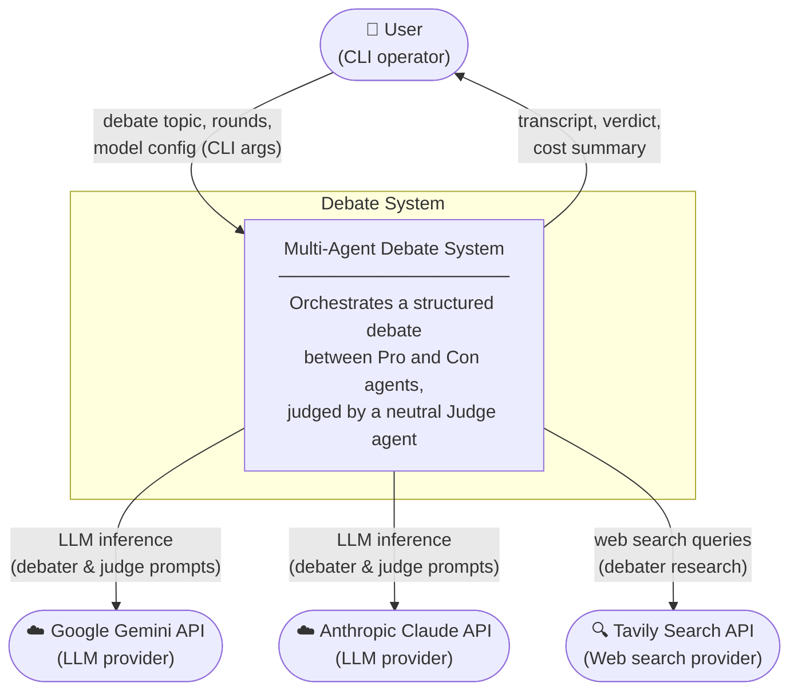
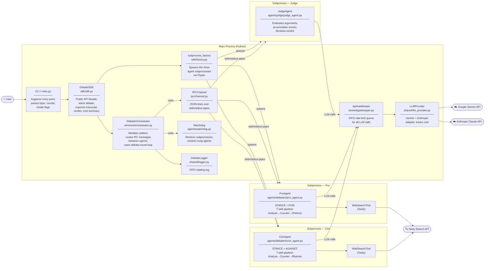

# C4 Architecture Diagrams

**Author:** Nadav Goldin — MSC AI Agents Exercise 02
**Date:** 2026-05-23

This document contains two C4-level diagrams for the multi-agent debate system: a Context diagram
showing the system's external relationships, and a Container diagram showing the major deployable
units and how they communicate.

---

## C4 Level 1 — System Context

Shows the debate system as a black box and identifies the external actors and APIs it interacts with.

---

## C4 Level 2 — Container Diagram

Shows the internal containers (processes and major shared components) and their interactions.

