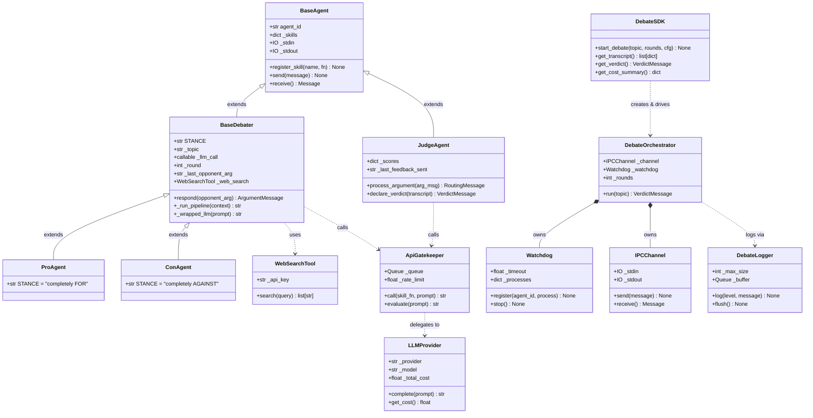

# OOP Class Hierarchy & Relationships

**Author:** Nadav Goldin — MSC AI Agents Exercise 02
**Date:** 2026-05-23

This diagram shows the full object-oriented class hierarchy of the debate system, including
inheritance chains, composition relationships, and dependency links between components.
`BaseAgent` sits at the root of the agent hierarchy; `BaseDebater` specialises it for
argumentation, and `ProAgent` / `ConAgent` concretise the stance. `JudgeAgent` inherits
directly from `BaseAgent`. Orchestration and SDK layers are shown as separate top-level classes
with their dependency arrows.

