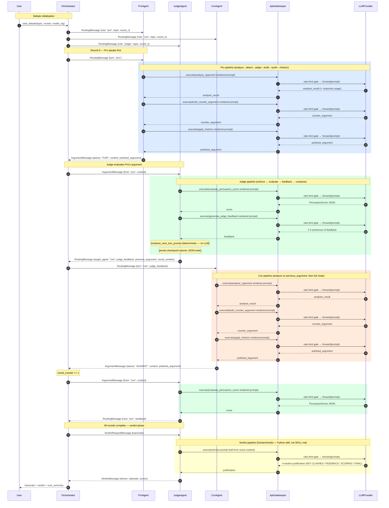

# UML Sequence Diagram — One Debate Round

**Author:** Nadav Goldin — MSC AI Agents Exercise 02
**Date:** 2026-05-23

This diagram traces the message flow through one complete debate round and the final verdict phase.
Each agent subprocess communicates with the Orchestrator exclusively through `IPCChannel`
(JSON-lines over stdin/stdout pipes). All LLM and Tavily calls are routed through `ApiGatekeeper.execute()`
which enforces the rate-limit FIFO queue and records cost before forwarding to the provider client.

> The "skill" steps shown below (analyze_opponent, build_counter_argument, evaluate_persuasion_score,
> generate_judge_feedback, etc.) are SKILL.md files loaded at runtime by `SkillLoader` — they are
> templates the agent renders with `{{ var }}` placeholders and then passes to the LLM closure.
> Deterministic skills (`adapt_strategy`, `synthesize_evidence`, `compose_next_turn_prompt`,
> `enforce_debate_mechanics`) execute in-process without an LLM call.
>
> RoutingMessage from Judge to next debater carries `previous_argument` (the just-evaluated
> argument) and `round_number` (the round the next speaker should use) — so a watchdog-respawned
> debater resumes with the real opponent text on the correct round.
>
> Not depicted for clarity: the Watchdog arms a `start_timer` around every `receive()` call;
> on hang, it kills + respawns the subprocess via the registered `restart_fn` closure and the
> orchestrator transparently re-sends the in-flight message (see `PRD_debate_orchestrator §6.2`).

