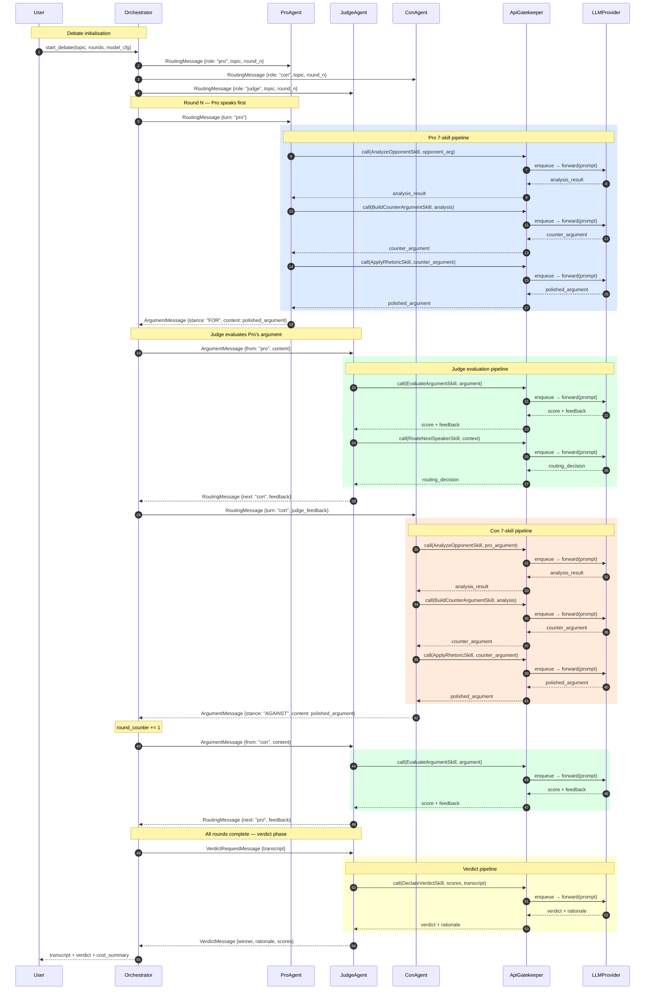

# UML Sequence Diagram — One Debate Round

**Author:** Nadav Goldin — MSC AI Agents Exercise 02
**Date:** 2026-05-23

This diagram traces the message flow through one complete debate round and the final verdict phase.
Each agent subprocess communicates with the Orchestrator exclusively through `IPCChannel`
(JSON-lines over stdin/stdout pipes). All LLM calls are serialised through `ApiGatekeeper`
to enforce the rate-limit FIFO queue before being forwarded to `LLMProvider`.

